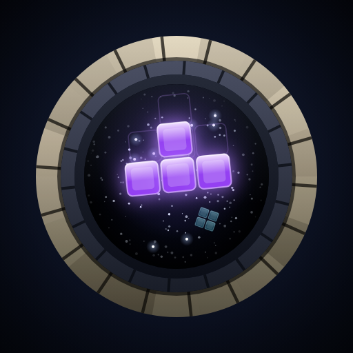

<div align="center">

# Gravity Well

**A faithful falling-block stacker for [Paul's Arcade](https://paulgibeault.github.io/).**

<a href="https://paulgibeault.github.io/grav-well/">
  
</a>

**▶ Play it here: <https://paulgibeault.github.io/grav-well/>**
· or launch it inside the arcade: <https://paulgibeault.github.io/#app=grav-well>



</div>

---

## About

> *The playfield in a falling-block game has been called **the well** since the
> genre began. Ours has gravity. All's well that lands well.*

Gravity Well is a **faithful modern-guideline stacker**: 7-bag randomizer, SRS
rotation with full wall kicks, hold, ghost piece, extended-placement lock
delay, T-spins, back-to-back, combos, and perfect clears. If you have muscle
memory from any current-generation stacker, it should transfer without a
single surprise — faithfulness *is* the design. Everything else — the name,
the art, the sound, the copy — is our own.

Blocks are salvage sinking into a gravity well. The stack glows faintly
against the dark, a line clear collapses with a gravitational shimmer, and a
perfect clear is a **Singularity** — the one moment per run when the well
stops being a quarry and rings like a pipe.

## Modes

| Mode | What it is |
| ---- | ---------- |
| **Arcade** | The default, and the standard endless game. No finish line: levels advance every 10 lines for as long as you last, gravity following the guideline curve down to true 20G at level 19 and pinned there. You play until you top out. |
| **Marathon** | Pick a level on the menu row and the run holds it — the curve never arrives, so the well stays playable for as long as you can keep it clear. Scoring takes the pinned level too, so a level-9 pin scores like level 9 from the first line. Each level keeps its own board and its own personal best. |
| **Sprint 40** | Clear 40 lines as fast as you can. Instant retry. |
| **Ultra** | Three minutes on the clock. Maximum score. |
| **Zen** | Level-1 gravity forever, no top-out, no timer. An overflowing well gently sinks rather than ending your run. |
| **Daily Well** | One shared seed per day: the well starts with eight rows of debris and everyone digs the same one. Same debris, same piece stream, fastest time. |

## Controls

**Gestures are the primary scheme, and the keyboard is always live too** —
there is no device detection and no mode where one of them is off. One
Pointer Events path serves phone touch, stylus, and laptop trackpad alike, so
a laptop with a touchscreen and a phone with a Bluetooth keyboard both just
work.

| Gesture | Action |
| --- | --- |
| Drag sideways | Move — the piece tracks your finger cell-for-cell |
| Tap | Rotate clockwise — or counter-clockwise, if you flip it in settings |
| Two-finger tap *(or right-click)* | Rotate the other way, whichever way that is |
| Flick down | Hard drop — or any downward drag of about four cells or more, however slow |
| Drag down a little | Soft drop, held until you lift or pull back up |
| Swipe up | Hold |

**Keyboard:** ←/→ move · ↓ soft drop · **Space** hard drop · ↑ or **X** rotate
CW · **Z** or Ctrl rotate CCW · **C** or Shift hold · **P**/Esc pause ·
**R** retry. Remappable, and keyed on physical position so AZERTY and Dvorak
work unchanged.

Settings are reachable from every settled screen — the menu, the pause card
and the results card — and closing them puts you back where you were.

An on-screen **button cluster** is available in settings as an accessibility
scheme, with handedness mirroring. Two gesture settings are yours rather than
ours, because both are questions about a thumb: **Flick sensitivity**, if the
swipe-down drop does not catch for you, and **Tap rotation**, if tapping turns
the piece the opposite way from the one you expect. Flipping the tap always
flips the two-finger tap with it, so you never lose the other direction. The
keyboard is unaffected — ↑/X and Z/Ctrl stay CW and CCW, and stay remappable.

## Features

- The full guideline ruleset — SRS wall kicks including the TST, 3-corner
  T-spin detection with mini/full distinction, back-to-back at ×1.5, combos,
  and perfect-clear bonuses
- Tunable **DAS / ARR / soft-drop factor** — the feel knobs modern stackers
  made table stakes
- Deterministic from one seed: same seed, same bag stream, same debris.
  A run interrupted mid-game and resumed replays identically
- Environmental audio via `Arcade.audio` — graph cues built from physical
  gestures (stone, rubble, breakage, a pawl, a drone) sharing one cistern
  room, voiced by *distance* rather than volume, over a bed that deepens as
  the stack rises
- **Escalating celebration** — a combo climbs a pitch ladder and counts itself
  out on a pawl; successive quads answer from further down the shaft each
  time, and a third in a row brings a beam up the well and a second blast
  behind it. The banner, the rail and the well all read the same heat ladder
- Personal bests and leaderboards via the
  [Paul's Arcade SDK](https://paulgibeault.github.io/) — per-mode records,
  a shared daily board, and lifetime stats
- **Skill records** that say what a run was interesting *for*, not just how
  big it was: best combo, longest back-to-back, longest quad streak, biggest
  single clear — kept across every mode that can top out
- **Piece glyphs** — an accessibility mode that engraves each piece with its
  own letter, so colour is never the only thing telling them apart
- Honors every launcher setting: theme, font scale, reduced motion,
  handedness, power saver, and volume
- Installable PWA, plays offline, and works standalone or inside the launcher

## Development

```sh
# from the launcher repo, which stages launcher + game on one origin
./dev.sh ../grav-well
```

```sh
npm test                  # contract gates + the full unit suite
node tools/stage.mjs dist # build the deploy artifact
node tools/verify-artifact.mjs
PLAYWRIGHT_BROWSERS_PATH=/opt/pw-browsers node tools/build-icon.mjs
```

The rules engine in `js/core/` is pure — no DOM, no SDK, no wall clock, and
no entropy of its own — which is what lets the whole ruleset be exercised
under `node --test`. A repo gate enforces that.

- **Design:** [`docs/DESIGN.md`](docs/DESIGN.md) · originally
  [issue #1](https://github.com/paulgibeault/grav-well/issues/1)
- **Module contract:** [`docs/ARCHITECTURE.md`](docs/ARCHITECTURE.md)
- **Fleet contract:** [GAME_INTEGRATION.md](https://github.com/paulgibeault/paulgibeault.github.io/blob/main/GAME_INTEGRATION.md)

## License

MIT — see [LICENSE](LICENSE).
